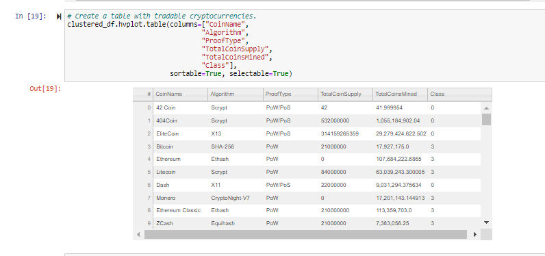

# Overview of the analysis

Accountability Accounting, a prominent investment bank, is interested in offering a new cryptocurrency investment portfolio for its customers.
They would like to create a report that includes what cryptocurrencies are on the trading market and how they could be grouped to create a 
classification system for this new investment.

In this project I will be working a Machine Learning model to fit the requirements of Accountability Accounting. Since there is no known output
for what we are looking for, unsurvised machine learning will be used. To group the cryptocurrencies, clustering algorithm will be used.

# Steps:

## Data was preprocessed for PCA

- Below is how the dataframe is looking after the preprocessing.

## Reducing Data Dimensions Using PCA

- The Principal Component Analysis (PCA) algorithm was applied to reduce the dimensions of the DataFrame to three principal components and 
  place these dimensions in a new DataFrame.

## Clustering Cryptocurrencies Using K-means

- Using the K-means algorithm, an elbow curve is created using hvPlot to find the best value for K. 
- Then, by running the K-means algorithm to predict the K clusters for the cryptocurrencies’ data.

## Visualizing Cryptocurrencies Results

- A 3D scatter plot is created with Plotly Express and hvplot to visualize the distinct groups that correspond to the three principal 
  components.
  

- A table was created with all the currently tradable cryptocurrencies using the hvplot.table() function.

